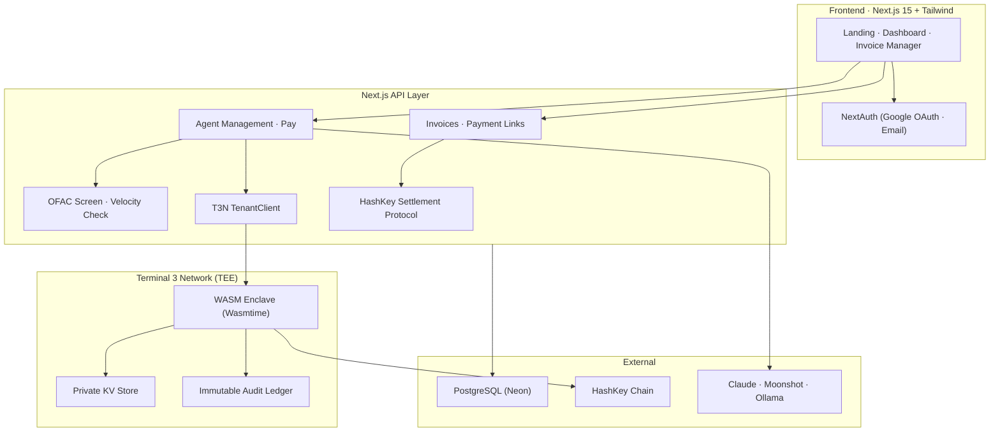
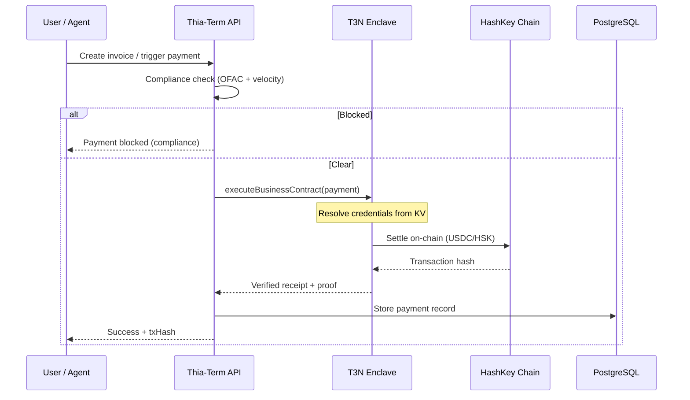

<p align="center">
  
</p>

<h1 align="center">Thia-Term</h1>

<p align="center">
  <b>Payment infrastructure for the agent economy — invoices, payroll, and AI agent payments secured by T3N TEE enclaves.</b>
</p>

<p align="center">
  <a href="https://thia-term.vercel.app"><b>Live App</b></a>
</p>

<p align="center">
  
  &nbsp;&nbsp;
  
  &nbsp;&nbsp;
  
  &nbsp;&nbsp;
  
  &nbsp;&nbsp;
  
</p>

---

Thia-Term is a compliance-first platform for on-chain invoicing, payment links, payroll, and autonomous AI agent payments. Built for the **Terminal 3 Agent Dev Kit (ADK) Bounty Challenge**, it uses T3N clusters (Intel TDX TEEs) for confidential settlement execution, credential management, and verifiable audit trails.

---

## 📌 Table of Contents

- [The Problem](#the-problem)
- [The Solution](#the-solution)
- [System Architecture](#system-architecture)
- [Payment Flow](#payment-flow)
- [Terminal 3 SDK Integration](#terminal-3-sdk-integration)
- [Core Features](#core-features)
- [Live Deployment](#live-deployment)
- [Repository Structure](#repository-structure)
- [Getting Started](#getting-started-local-development)
- [Environment Variables](#environment-variables)
- [Team](#team)
- [References](#references)
- [License](#license)

---

## ❌ The Problem

As AI agents become economic actors, they need payment infrastructure that builds trust over time. Existing solutions suffer from:

* **No Agent Identity** — Agents lack portable cryptographic identities, making it impossible to build verifiable payment histories.
* **Manual Compliance** — Every agent-to-agent or agent-to-human payment requires manual sanctions screening and risk scoring.
* **Exposed Credentials** — Agent wallet keys sit in environment variables or memory, vulnerable to host compromise.
* **Unauditable Transactions** — No tamper-proof ledger that ties compliance checks, payment execution, and identity verification together.

---

## ✅ The Solution (T3N ADK Powered)

Thia-Term integrates **Terminal 3 ADK** to make agent payments private, verifiable, and compliance-ready:

* **Decentralized Identities (`did:t3n`):** Every tenant and vendor gets a portable cryptographic identity via Ethereum auth.
* **TEE Enclave Contracts:** Vendor verification and payment logic runs as compiled WASM components (`wasm32-wasip2`) inside Intel TDX enclaves.
* **Confidential KV Store:** API keys and credentials are stored in encrypted `z:<tid>:*` maps, resolved inside the enclave.
* **Compliance Pipeline:** Every payment runs through OFAC sanctions screening, velocity checks, and KYC verification before execution.
* **Immutable Audit Trail:** All compliance checks, payment attempts, and settlements logged on the T3N ledger.

---

## 🏛️ System Architecture



---

## 🔄 Payment Flow



---

## 🔌 Terminal 3 SDK Integration

### 1. Tenant Authentication (`did:t3n`)
* **Code Location:** [`lib/t3n-client.ts`](lib/t3n-client.ts)
* **Details:** Uses `@terminal3/t3n-sdk` to handshake, authenticate via EIP-191 (MetaMask API key signing), and yield a verified `did:t3n` for the tenant.

### 2. Vendor Credential Verification
* **Code Location:** [`lib/vendor-verify.ts`](lib/vendor-verify.ts)
* **Details:** Cross-tenant `executeBusinessContract` call to verify a supplier's credential status. Returns a verifiable proof with score, signature, and DID.

### 3. Vendor Payment Execution
* **Code Location:** [`lib/vendor-verify.ts`](lib/vendor-verify.ts)
* **Details:** Runs `process-payment` function in the TEE contract via `t3n.executeAndDecode()`, which settles USDC/HSK on-chain.

### 4. Agent Wallet Derivation (BIP-32)
* **Code Location:** [`lib/agent-wallet.ts`](lib/agent-wallet.ts)
* **Details:** Deterministic agent wallet addresses derived from `DEPLOYER_MNEMONIC` using `@scure/bip32` + `@noble/curves/secp256k1` — no viem/wagmi dependency.

### 5. Agent Payment Execution (T3N)
* **Code Location:** [`lib/agent-wallet.ts`](lib/agent-wallet.ts)
* **Details:** Agent-to-agent and agent-to-human payments routed through T3N `executeAndDecode()` with automatic contract resolution.

### 6. Managed Wallet Encryption
* **Code Location:** [`lib/wallet-crypto.ts`](lib/wallet-crypto.ts)
* **Details:** AES-256-GCM encryption for seed phrases and private keys. Mnemonics generated at `/api/user/wallet/seed` and stored encrypted — never in plaintext in the database.

---

## 🧩 Core Features

| Layer | Feature | Status | T3N |
|-------|---------|--------|-----|
| **H2H** | Invoicing + Payment Links | Live | Settlement |
| **H2H** | HSP Multi-Pay Mandates | Live | - |
| **H2A** | AI Agent Registration | Live | Identity |
| **H2A** | Agent Wallets (BIP-32) | Live | - |
| **A2A** | Agent-to-Agent Payment | Q1 2026 | Execution |
| **A2A** | Cross-Tenant Vendor Verify | Live | `executeBusinessContract` |
| **All** | OFAC Sanctions Screening | Live | - |
| **All** | Compliance Audit Trail | Live | Ledger |

---

## 🌐 Live Deployment

* **Web Application:** [thia-term.vercel.app](https://thia-term.vercel.app)
* **T3N Environment:** `testnet`
* **Sandbox Allocation:** 20,000 test tokens

---

## 📂 Repository Structure

```text
thia-term/
├── app/
│   ├── api/                  # API routes (invoices, agents, payments, auth, t3n)
│   ├── login/                # Login page
│   ├── dashboard/            # Dashboard
│   ├── invoices/             # Invoice management
│   ├── links/                # Payment links
│   ├── l/[code]/             # Public payment link page
│   ├── pay/invoice/[id]/     # Public invoice payment page
│   └── layout.tsx            # Root layout + SessionProvider
├── components/
│   ├── landing/              # Landing page sections
│   ├── ui/                   # shadcn/ui primitives
│   ├── dashboard-layout.tsx  # Dashboard shell + sidebar
│   ├── payment-flow.tsx      # Payment UI
│   ├── wallet-*.tsx          # Wallet management modals
│   └── vendors-module.tsx    # Vendor verification UI
├── lib/
│   ├── t3n-client.ts         # T3N SDK wrapper
│   ├── agent-wallet.ts       # BIP-32 derivation + T3N payment
│   ├── vendor-verify.ts      # Cross-tenant vendor verification
│   ├── auth-config.ts        # NextAuth config (Google + email)
│   ├── compliance.ts         # OFAC + velocity checks
│   ├── wallet-crypto.ts      # AES-256-GCM encryption
│   ├── audit.ts              # Audit logging
│   ├── hsp-client.ts         # HashKey Settlement Protocol
│   └── agent-engine.ts       # Claude-powered AI agents
├── prisma/
│   └── schema.prisma         # Database schema
├── contracts/                # Solidity contracts
├── plan-deploy.md            # Deployment guide
└── AGENTS.md                 # AI assistant context
```

---

## 🚀 Getting Started (Local Development)

### Prerequisites
* Node.js ≥ 20, pnpm ≥ 9

### 1. Installation
```bash
git clone https://github.com/your-org/thia-term.git
cd thia-term
pnpm install
```

### 2. Environment Configuration
```bash
cp .env.example .env.local
# Fill in required values: DATABASE_URL, DIRECT_URL, NEXTAUTH_SECRET, etc.
```

### 3. Database Setup
```bash
npx prisma migrate dev --name init
```

### 4. Run Development Server
```bash
pnpm dev
# → http://localhost:3000
```

### Commands

| Command | Action |
|---------|--------|
| `pnpm dev` | Start dev server |
| `pnpm build` | Prisma generate + Next.js build |
| `pnpm typecheck` | TypeScript check (`tsc --noEmit`) |
| `pnpm lint` | ESLint (`next lint`) |

---

## 🔐 Environment Variables

| Variable | Required | Description |
|----------|----------|-------------|
| `DATABASE_URL` | Yes | Neon pooled PostgreSQL |
| `DIRECT_URL` | Yes | Neon direct connection (migrations) |
| `NEXTAUTH_SECRET` | Yes | NextAuth encryption secret |
| `GOOGLE_CLIENT_ID` | Yes | Google OAuth client ID |
| `GOOGLE_CLIENT_SECRET` | Yes | Google OAuth client secret |
| `DEPLOYER_MNEMONIC` | Yes | BIP-39 mnemonic for agent wallets |
| `WALLET_ENCRYPTION_KEY` | Yes | 64-char hex for AES-256-GCM |
| `T3N_API_KEY` | Yes | Terminal 3 API key |
| `T3N_ENVIRONMENT` | Yes | `testnet` or `production` |
| `T3N_DID` | Yes | Tenant DID minted at terminal3.io |
| `HSP_*` | No | HashKey Settlement Protocol |
| `MOONSHOT_API_KEY` | No | Moonshot AI (primary) |
| `ANTHROPIC_API_KEY` | No | Claude (fallback) |

---

## 👥 Team

Built by **Thia-Term**:
* **EM** — Full-stack developer & T3N Integration engineer

---

## 📚 References
* [Terminal 3 Documentation](https://docs.terminal3.io)
* [T3N SDK (`@terminal3/t3n-sdk`)](https://www.npmjs.com/package/@terminal3/t3n-sdk)
* [WASI Preview 2 Specification](https://wasi.dev)
* [Intel TDX TEE Technology](https://intel.com)
* [HashKey Chain](https://hashkey.com)
* [HashKey Settlement Protocol](https://hsp.hashkey.com)

---

## 📄 License

Commercial software — all rights reserved.

---

<p align="center">
  <b>Thia-Term · Built for the Terminal 3 Agent Dev Kit Bounty Challenge</b><br>
  <i>Invoice, pay, and automate — with compliance built in.</i>
</p>
